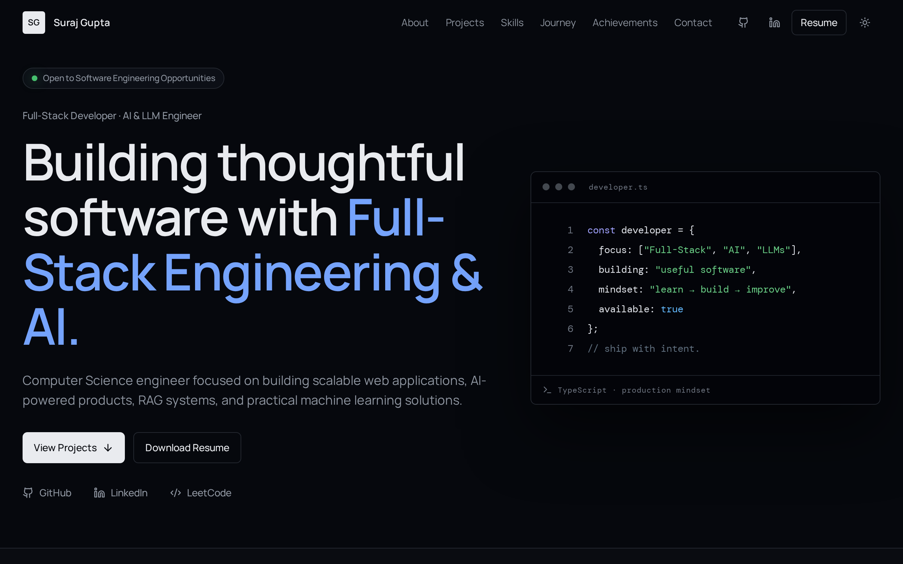
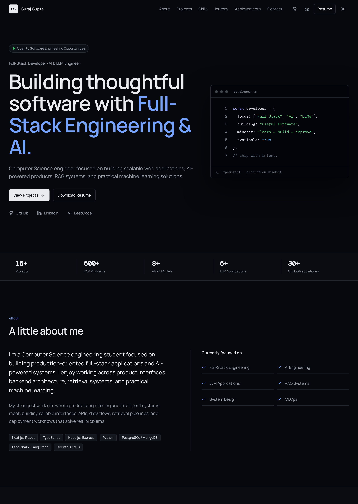

<h1 align="center">Hi there 👋, I'm Suraj Kumar Gupta</h1>

<p align="center">
  <em>Full-Stack Developer · AI & LLM Engineer · Machine Learning Enthusiast</em>
</p>

<p align="center">
  <a href="https://github.com/Surajgupta001"></a>
  <a href="https://www.linkedin.com/in/suraj-gupta-15634028a/"></a>
  <a href="https://suraj-builds-ai.lovable.app"></a>
  <a href="https://leetcode.com/u/neZEZlegAW/"></a>
</p>

<p align="center">
  
## 🖼️ Portfolio Preview




</p>

---

## 👨‍💻 About Me

I'm a **Computer Science & Engineering student at KIIT University**, focused on building real-world software products across **Full-Stack Development, AI/ML, Generative AI, and LLM applications**.

I enjoy going beyond tutorials and building complete systems — from architecture and database design to APIs, authentication, AI integration, deployment, and production workflows. My strongest engineering interests:

**Full-Stack Web Development · Software Engineering · AI/ML · Generative AI · LLM Applications · RAG & Hybrid-RAG · AI Agents · Backend Engineering · Cloud & DevOps · Data Structures & Algorithms**

---

## 🚀 Engineering Experience

*Independent, self-directed engineering experience — everything below was designed, built, and shipped by me end-to-end.*

I've built and deployed **8+ production applications**, working extensively with **Next.js, React, TypeScript, Node.js, Python, FastAPI, PostgreSQL, MongoDB, Prisma, Redis, Docker, AWS, Vercel, and Render**. That work spans REST APIs, authentication systems, role-based authorization, payment integrations, background jobs, dashboards, and cloud deployments.

On the AI side, I've built applications around **LLMs, RAG, Hybrid-RAG, vector databases, embeddings, knowledge graphs, LangChain, LangGraph, and query routing** — moving beyond chat wrappers into real retrieval and reasoning systems. I also work with CI/CD using **GitHub Actions, Docker, AWS EC2, and AWS ECR** to automate testing, containerization, and deployment.

And underpinning all of it: **500+ Data Structures & Algorithms problems** solved across LeetCode and Codeforces.

---

## 🤖 AI / ML Journey

AI/ML isn't a bolt-on for me — it's a core track of how I learn and build.

### 📊 Machine Learning

- **Python · NumPy · Pandas · Scikit-Learn · TensorFlow**
- Regression, classification, model evaluation, data preprocessing
- ML pipelines & MLOps — making training repeatable and deployable

### 🧬 Generative AI

- LLMs & Prompt Engineering
- RAG & Hybrid-RAG
- Embeddings & Vector Search
- Knowledge Graphs
- LangChain & LangGraph
- AI Agents & Tool Calling

### 🧠 LLM Engineering — from scratch

To understand how LLMs actually work internally (not as a buzzword), I implemented a **GPT-2-style language model from scratch**, including:

- A **custom tokenizer**
- **Multi-head attention**
- **Autoregressive generation**

Building it by hand taught me what the abstractions hide — and made every LLM application I've built since more deliberate.


---

## 🧩 RAG / AI Systems

I'm particularly interested in building **practical AI systems** that answer questions reliably — not just impressively. My **Hybrid-RAG** work is the best example.

Vector similarity alone misses explicit relationships and multi-hop context. So I built a hybrid retrieval system that combines multiple signals:

- **Dense vector retrieval** with **ChromaDB** for semantic similarity
- **Knowledge graphs** built with **NetworkX**, using **LLM-based triple extraction** to pull structured (subject → relation → object) facts from documents
- **Query routing** — an LLM decides whether a query needs vector search, graph traversal, or both
- **Hybrid retrieval** — vector + graph + hybrid paths merged into coherent context

The result: answers grounded in both *semantic meaning* and *explicit relationships*, enabling **multi-hop reasoning** that pure vector search can't handle.

---

## 💻 Full-Stack Development

I enjoy building **complete products** — not only frontend interfaces. From database schema to deployment, I care about the whole pipeline.

### 🎨 Frontend

       

### ⚙️ Backend

     

REST APIs · JWT authentication · Authorization · Role-Based Access Control

### 🗄️ Databases

     

---

## ☁️ Cloud & DevOps

I'm interested in understanding how applications move from development to **reliable production systems**:

- **Docker** — containerizing applications for consistent environments
- **GitHub Actions** — CI/CD workflows for automated testing & deployment
- **AWS EC2 / AWS ECR** — container registry and cloud compute deployments
- **Vercel · Render** — managed deployment for web apps and services
- **Linux** — day-to-day comfort with the command line and servers

---

## 🛠️ Technology Stack

| Category | Technologies |
|---|---|
| **Languages** | TypeScript · JavaScript · Python · C++ · SQL |
| **Frontend** | React · Next.js · Tailwind CSS · shadcn/ui · Redux Toolkit · Framer Motion |
| **Backend** | Node.js · Express.js · Bun · FastAPI · REST APIs · JWT · RBAC |
| **Databases** | PostgreSQL · MongoDB · Prisma · Redis · Supabase · Neon · FAISS · ChromaDB |
| **AI / ML** | Scikit-Learn · TensorFlow · NumPy · Pandas · Model Evaluation · MLOps |
| **LLM / GenAI** | LangChain · LangGraph · RAG · Hybrid-RAG · Knowledge Graphs · AI Agents · Prompt Engineering |
| **Cloud & DevOps** | Docker · GitHub Actions · AWS EC2 / ECR · Vercel · Render · CI/CD |
| **Developer Tools** | Git · VS Code · Linux · Postman · Vite |


---

## 🚀 Featured Projects

### 🛒 [GoCart](https://github.com/Surajgupta001/NEXT-JS-PROJECTS/tree/main/gocart) — Multi-Vendor E-Commerce Platform

A modern multi-vendor marketplace with distinct buyer, seller, and admin workflows.
**Tech Stack:** Next.js · React · TypeScript · Redux Toolkit · Prisma · PostgreSQL · Stripe · Clerk · ImageKit · OpenAI SDK

- Built role-aware workflows for **buyers, sellers, and admins** on a shared, scalable Prisma + PostgreSQL data layer
- Integrated **secure Stripe payments**, Clerk authentication, and media management via ImageKit
- Added an **AI-powered listing assistant** (OpenAI SDK) to streamline product creation
- 🔗 [Live](https://gocart-drab.vercel.app/)

### 🛍️ FreshCart — Full-Stack Grocery Delivery Platform

A multi-portal grocery delivery system covering the complete order lifecycle.
**Tech Stack:** Node.js · Express · JWT · Stripe · Redis · Cloudinary · Inngest

- Built **customer, store-admin, and delivery-partner portals** with JWT authentication and **role-based access control**
- Integrated **Stripe with webhook verification** for trustworthy payments
- Implemented **live order tracking**, **OTP delivery verification**, Cloudinary media, and **Inngest** background jobs

### 🧠 [HYBRID-RAG](https://github.com/Surajgupta001/HYBRID-RAG) — Advanced AI Retrieval System

Combines vector search, knowledge graphs, and LLM-powered query routing.
**Tech Stack:** Python · Gemini · ChromaDB · NetworkX · Knowledge Graphs · RAG

- Built **dense vector retrieval** with ChromaDB alongside **knowledge-graph traversal** via NetworkX
- Used **LLM-based triple extraction** to structure documents into graph facts, enabling **multi-hop reasoning**
- Implemented **query routing** that selects vector, graph, or hybrid retrieval per query

### 📄 [RAG Chatbot](https://github.com/Surajgupta001/rag-chatbot) — Document Intelligence

End-to-end document intelligence with Retrieval-Augmented Generation.
**Tech Stack:** Python · FastAPI · LangChain · Groq · FAISS · Sentence Transformers · Docker

- Built a full **document ingestion → chunking → embedding → retrieval → generation** pipeline
- Grounded conversations in user-uploaded documents with semantic retrieval (FAISS)
- **Dockerized** and deployed to Render
- 🔗 [Live](https://rag-chatbot-njoo.onrender.com/)

### 🤖 [J.A.R.V.I.S. OS v4.0](https://github.com/Surajgupta001/JARVIS) — Autonomous AI Assistant

A voice-enabled assistant combining LLMs, RAG, web search, speech synthesis, and desktop automation.
**Tech Stack:** Python · LangChain · Groq · FAISS · Sentence Transformers · Streamlit · Edge-TTS

- Orchestrated **retrieval, web search, voice I/O, and desktop tools** behind a unified interaction flow
- Maintained useful context while coordinating multiple AI and system tools

### 💰 Invoice Intelligence Dashboard — Freight-Cost ML

Machine learning applied to invoice analytics.
**Tech Stack:** Python · Streamlit · Scikit-Learn · Plotly · Pandas

- Built **freight-cost prediction** and **risk classification** models on invoice data
- Delivered insights through an interactive **Streamlit dashboard** with Plotly visualizations

### 🧾 [AI Resume Builder](https://github.com/Surajgupta001/MERN-STACK-PROJECT/tree/main/AI%20Resume%20Builder) — Full-Stack AI Platform

An AI-powered platform for creating, enhancing, managing, and publishing professional resumes.
**Tech Stack:** React · Node.js · Express · MongoDB · Redux Toolkit · Gemini API · ImageKit

- Synchronized editable structured content with **AI-assisted writing suggestions**
- Handled media management and publishable output end-to-end
- 🔗 [Live](https://mern-stack-project-1-sxrm.onrender.com)

### 🔄 [ML Pipeline with CI/CD](https://github.com/Surajgupta001/ML-Project-CICD) — MLOps

An end-to-end ML pipeline with automated training, Dockerization, CI/CD, and AWS deployment.
**Tech Stack:** Python · Scikit-Learn · Docker · GitHub Actions · AWS ECR · AWS EC2 · Flask

- Automated the path from **data preparation and training** to containerized cloud deployment
- Built a **GitHub Actions CI/CD workflow** pushing images to AWS ECR and deploying to AWS EC2


---

## 🧩 How I Build

My engineering philosophy, in practice:

- **Understand fundamentals first.** I implemented a GPT-2-style model from scratch because I want to understand systems, not blindly use abstractions.
- **Build things from scratch.** Databases, auth, pipelines, retrieval — I learn by implementing before leaning on tools.
- **Turn ideas into working products.** Tutorials end where projects begin; I ship complete systems with real users in mind.
- **Explore new tech through real projects.** Every new technology I pick up gets applied to something that actually needs it.
- **Continuously improve.** Architecture and code quality are iterative — I refactor as I learn better designs.

---

## 📚 DSA & Computer Science

**500+ problems solved** across LeetCode and Codeforces, covering:

- Data Structures & Algorithms
- Graphs
- Dynamic Programming
- Greedy Algorithms
- Problem Solving

Alongside CS foundations: **Operating Systems · DBMS · Computer Networks · OOP**.

---

## 🎯 Current Focus

- **Deepening my understanding** of advanced AI/LLM engineering and RAG systems
- **Exploring** AI agents and agentic workflows
- **Building toward** production-grade full-stack architecture and system design
- **Improving** backend engineering and MLOps practices
- **Learning** cloud infrastructure for reliable deployments

---

## 🌍 Career Direction

I'm interested in opportunities involving:

**Software Engineering · Full-Stack Engineering · Backend Engineering · AI Engineering · Machine Learning Engineering · LLM / Generative AI · AI Application Development**

---

## 🤝 Collaboration

I'm interested in collaborating on **AI/ML projects, LLM applications, developer tools, full-stack products, open-source projects, and interesting engineering experiments** — especially where the hard part is the system design, not the tech stack.

---

## 📊 GitHub Stats

<p align="center">
  
  
</p>

<p align="center">
  
</p>

---

## 📫 Connect With Me

**Let's Connect** 🤝

[🌐 **Portfolio**](https://suraj-builds-ai.lovable.app/) · [💻 **GitHub**](https://github.com/Surajgupta001) · [💼 **LinkedIn**](https://www.linkedin.com/in/suraj-gupta-15634028/) · [📸 **Instagram**](https://instagram.com/suraj_env) · [📧 **Email**](mailto:surajgupta7070031833@gmail.com)

<p align="center">
  <a href="https://suraj-builds-ai.lovable.app/"></a>
  <a href="https://github.com/Surajgupta001"></a>
  <a href="https://www.linkedin.com/in/suraj-gupta-15634028/"></a>
  <a href="https://instagram.com/suraj_env"></a>
  <a href="mailto:surajgupta7070031833@gmail.com"></a>
</p>

> 🌐 The **Portfolio** is the best place to start — it features my latest projects and professional information.

---

## 🌐 This Portfolio

A high-end, professional developer portfolio built with **TanStack Start + shadcn/ui**.
**Live site:** https://suraj-builds-ai.lovable.app

### 🖼️ Full Page Preview



### Features

- **Dark-first premium design** — Vercel/Linear-inspired minimal aesthetic with charcoal surfaces, subtle borders, and blue/violet accents; polished light mode included
- **Sticky responsive navigation** — section links, social icons, resume download, theme toggle, and an accessible mobile menu
- **Project case studies** — each project card opens a detailed dialog with overview, problem, solution, key features, engineering considerations, and tech stack
- **Animated stat counters** — subtle number animations that respect `prefers-reduced-motion`
- **Skills taxonomy** — category tabs across Frontend, Backend, Databases, AI & LLM, Machine Learning, Cloud & DevOps, Programming, and CS Fundamentals
- **Journey timeline** — visual timeline from 2021 to present with the current milestone highlighted
- **Validated contact form** — opens a mail draft; no fake sending
- **SEO & accessibility** — semantic HTML, Open Graph metadata, keyboard navigation, focus states, and reduced-motion support

### Getting Started

```sh
# Install dependencies
npm install

# Start the dev server
npm run dev

# Build for production
npm run build
```

### Project Structure

```
├── public/
│   └── resume.pdf              # Downloadable resume
├── src/
│   ├── components/
│   │   ├── portfolio/          # Page sections & reusable components
│   │   └── ui/                 # shadcn-style UI primitives
│   ├── data/
│   │   └── portfolio.ts        # Single source of truth for all content
│   ├── hooks/                  # Motion & utility hooks
│   ├── lib/                    # Shared utilities
│   └── routes/                 # File-based routes
└── vite.config.ts
```

All portfolio content (profile, projects, skills, milestones, stats) lives in `src/data/portfolio.ts` — edit that one file to update the site.

---

© 2026 Suraj Kumar Gupta · Built with TanStack Start + shadcn/ui

